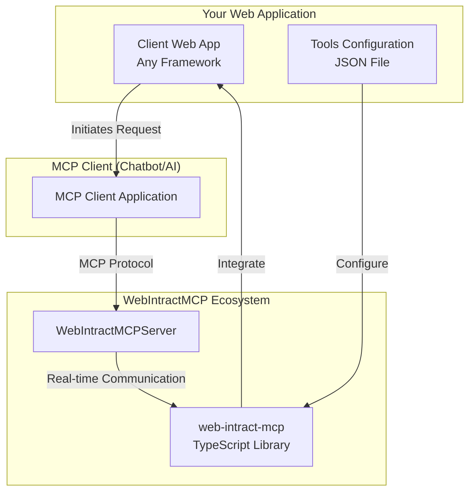

# WebIntractMCP

> Transform any web application into an MCP server with real-time two-way communication

[](LICENSE)
[](https://github.com/Vijay-Nirmal/WebIntractMCP)
[](https://github.com/Vijay-Nirmal/WebIntractMCP)

WebIntractMCP is an innovative MCP (Model Context Protocol) ecosystem that enables any web application to become an MCP server, allowing chatbots and other MCP clients to control client sessions and complete intended actions on behalf of users.

> **📢 Initial preview version will be published soon!** This project is in active development. Expect breaking changes in future releases as we evolve toward version 1.0.

## 🚀 Overview

WebIntractMCP consists of two tightly integrated components that work together to create a seamless MCP experience:

- **📚 [web-intract-mcp](lib/web-intract-mcp)** - TypeScript library for client-side integration
- **🖥️ [WebIntractMCPServer](server/WebIntractMCPServer)** - Ready to deploy Docker MCP server image for protocol handling
- **🎯 [Sample Implementation](sample/angular-dotnetnet-semantic-kernel)** - Complete Angular + .NET example

## ✨ Key Features

- **🔧 Support full MCP Tool protocol** - including tool discovery, invocation, and all type of response Text, Image, Audio others
- **🔄 Real-time Communication** - Robust bidirectional communication using SignalR which support WebSockets, ServerSentEvents, LongPolling
- **🛠️ Dynamic Tool Registration** - Configure tools with simple JSON files
- **🎯 Session-based Control** - Per-user session management for secure isolation
- **🌐 Framework Agnostic** - Works with any JavaScript framework (React, Angular, Vue, etc.)
- **⚡ Production Ready** - Comprehensive error handling and performance optimization
- **🔧 Simple Configuration** - Easy setup with JSON-based tool definitions
- **📦 Docker Support** - Ready-to-use Docker image for easy deployment
- **📄 Page-specific Tools** - Define tools that can interact with specific pages or elements
- **🎨 Visual Feedback** - Provides visual feedback for tool execution and user actions

## 🎬 Demo

<iframe width="560" height="315" src="assets/WebIntractMCP_Demo.mp4" frameborder="0" allow="accelerometer; autoplay; clipboard-write; encrypted-media; gyroscope; picture-in-picture" allowfullscreen></iframe>
<iframe width="560" height="315" src="/assets/WebIntractMCP_Demo.mp4" frameborder="0" allow="accelerometer; autoplay; clipboard-write; encrypted-media; gyroscope; picture-in-picture" allowfullscreen></iframe>
<iframe width="560" height="315" src="https://raw.githubusercontent.com/Vijay-Nirmal/WebIntractMCP/refs/heads/master/assets/WebIntractMCP_Demo.mp4" frameborder="0" allow="accelerometer; autoplay; clipboard-write; encrypted-media; gyroscope; picture-in-picture" allowfullscreen></iframe>
<video src="assets/WebIntractMCP_Demo.mp4" width="320" height="240" controls></video>
<video src="/assets/WebIntractMCP_Demo.mp4" width="320" height="240" controls></video>
<video src="https://raw.githubusercontent.com/Vijay-Nirmal/WebIntractMCP/refs/heads/master/assets/WebIntractMCP_Demo.mp4" width="320" height="240" controls></video>

*Click to view the demonstration of WebIntractMCP transforming a web application into an MCP server*

## 🏗️ Architecture



## 🚀 Quick Start

### 1. Install the Client Library

```bash
npm install web-intract-mcp
```

### 2. Configure Your Tools

Create a `mcp-tools.json` file:

```json
[
  {
    "toolId": "click-button",
    "title": "Click Button",
    "description": "Clicks a specific button on the page",
    "mode": "silent",
    "steps": [
      {
        "targetElement": "#submit-btn",
        "action": { "type": "click", "element": "#submit-btn" }
      }
    ]
  }
]
```

### 3. Initialize in Your Web App

```typescript
import { createWebIntractMCPController } from 'web-intract-mcp';

const controller = createWebIntractMCPController();
await controller.loadTools('/mcp-tools.json');
await controller.createSession('http://localhost:8080');
```

### 4. Run the MCP Server

```bash
# Using Docker
docker run -p 8080:8080 webintract-mcp-server

# Or build from source
cd server/WebIntractMCPServer
dotnet run
```

## 📁 Project Structure

```
WebIntractMCP/
├── lib/web-intract-mcp/           # TypeScript MCP Library
│   ├── src/                       # Source code
│   └── README.md                  # Library documentation
├── server/WebIntractMCPServer/    # .NET MCP Server
│   ├── Program.cs                 # Server entry point
│   └── README.md                  # Server documentation
├── sample/                        # Reference implementations
│   └── angular-dotnetnet-semantic-kernel/
```

## 🎯 Use Cases

- **Automated Testing** - Control web applications for E2E testing
- **User Onboarding** - Create guided tours and tutorials
- **Process Automation** - Automate repetitive web-based tasks
- **Accessibility** - Provide AI-powered navigation assistance
- **Data Entry** - Automate form filling and data collection

## 🔧 Technology Stack

| Component | Technologies |
|-----------|-------------|
| **Client Library** | TypeScript 5.8+, SignalR, Shepherd.js |
| **MCP Server** | .NET 9, ASP.NET Core, SignalR |
| **Sample App** | Angular 20, Semantic Kernel |

## ⚠️ Development Status

**Initial preview version will be published soon. This project is in active development and has not yet reached version 1.0.**

- ✅ Core functionality is working
- ✅ Production-ready components available
- 🚀 Initial preview version coming soon
- ⚠️ Breaking changes expected in future releases
- ⚠️ API is subject to change before 1.0 release

Feel free to use it in your projects, but be prepared for potential breaking changes as we approach the initial preview release.

## 📖 Documentation

- [Client Library Guide](lib/web-intract-mcp/README.md) - Complete TypeScript library documentation
- [Server Setup Guide](server/README.md) - MCP server configuration and deployment
- [Sample Implementation](sample/angular-dotnetnet-semantic-kernel/README.md) - Working example with Angular and .NET

## 🤝 Contributing

We welcome contributions! Please see our [contributing guidelines](.github/copilot-instructions.md) for development standards and workflow.

### Development Workflow

```bash
# Setup
npm install
cd lib/web-intract-mcp && npm install
cd sample/angular-dotnetnet-semantic-kernel && npm install

# Start development environment with sample app
cd sample/angular-dotnetnet-semantic-kernel
npm run start:server    # Web Intract MCP server
npm run start:client    # .NET client backend sample app
npm run start           # Angular frontend sample app
```

## 📄 License

This project is licensed under the MIT License - see the [LICENSE](LICENSE) file for details.

## 🔗 Links

- [GitHub Issues](https://github.com/Vijay-Nirmal/WebIntractMCP/issues) - Report bugs or request features
- [Discussions](https://github.com/Vijay-Nirmal/WebIntractMCP/discussions) - Community discussions

---

**Built with ❤️ for the MCP ecosystem**
