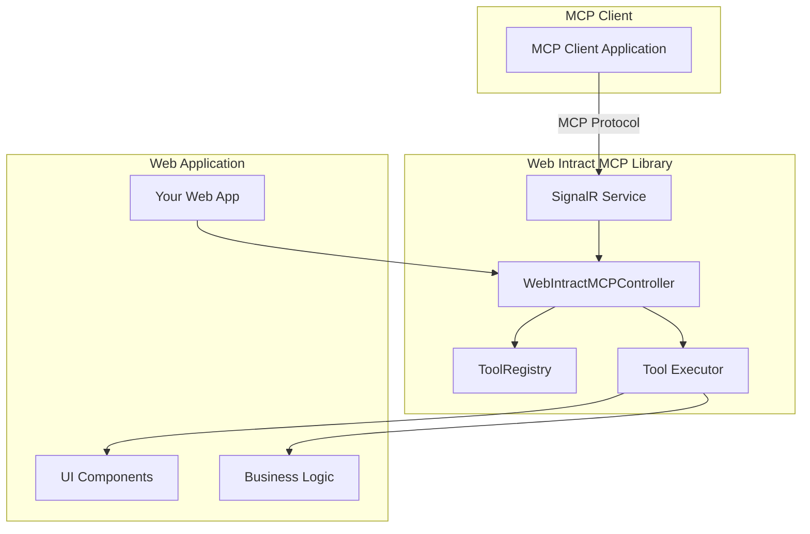

# Web Intract MCP

A production-ready TypeScript library that transforms web applications into MCP (Model Context Protocol) servers with robust two-way communication via SignalR.

## Overview

Web Intract MCP enables client web applications to expose their functionality as MCP tools through a powerful automation and communication framework. It acts as a bridge between MCP clients and web applications, allowing seamless tool registration, execution, and real-time communication.

## Key Features

- **🔄 Real-time Communication**: Robust bidirectional communication using SignalR
- **🛠️ Tool Management**: Dynamic tool registration and execution with comprehensive validation
- **🎯 UI Automation**: Advanced web automation with visual feedback and guided tours
- **📐 Type Safety**: Full TypeScript support with comprehensive type definitions
- **🧩 Framework Agnostic**: Works with any JavaScript framework (React, Angular, Vue, etc.)
- **⚡ Production Ready**: Comprehensive error handling, logging, and performance optimization
- **🔧 Configurable**: Extensive configuration options for different deployment scenarios
- **🎨 Visual Effects**: Rich visual feedback system with customizable animations

## Architecture



## Installation

```bash
npm install web-intract-mcp
```

### Peer Dependencies

```bash
npm install shepherd.js @microsoft/signalr
```

## Quick Start

### Basic Setup

```typescript
import { 
  createWebIntractMCPController, 
  ToolConfiguration,
  ToolMode 
} from 'web-intract-mcp';

// Create controller instance
const controller = createWebIntractMCPController();

// Define a simple tool
const sampleTool: ToolConfiguration = {
  toolId: 'click-button',
  title: 'Click Button',
  description: 'Clicks a specific button on the page',
  mode: 'silent' as ToolMode,
  steps: [
    {
      targetElement: '#submit-btn',
      content: 'Clicking the submit button',
      action: {
        type: 'click',
        element: '#submit-btn'
      }
    }
  ]
};

// Load tools
await controller.loadTools([sampleTool]);

// Create session with MCP server
const sessionId = await controller.createSession('http://localhost:8080');
console.log('Session created:', sessionId);
```

### Advanced Configuration

```typescript
import { 
  createWebIntractMCPController,
  WebIntractMCPOptions,
  VisualEffectStyles
} from 'web-intract-mcp';

// Configure controller options
const options: Partial<WebIntractMCPOptions> = {
  enableVisualFeedback: true,
  debugMode: true,
  elementTimeout: 10000,
  highlightDuration: 3000,
  actionDelay: 1000
};

// Custom visual styles
const customStyles: VisualEffectStyles = {
  highlight: {
    primaryColor: 'rgba(34, 197, 94, 0.5)',
    duration: 2
  },
  clickRipple: {
    backgroundColor: 'rgba(34, 197, 94, 0.6)',
    size: 30
  }
};

const controller = createWebIntractMCPController(undefined, options);
controller.updateVisualEffectStyles(customStyles);
```

## Tool Configuration

### Tool Modes

#### 1. Normal Mode
Interactive guided tours with navigation buttons:

```typescript
const guidedTool: ToolConfiguration = {
  toolId: 'user-onboarding',
  title: 'User Onboarding Tour',
  description: 'Guides new users through the application',
  mode: 'normal',
  steps: [
    {
      targetElement: '.welcome-section',
      content: 'Welcome to our application! Let\'s start with a quick tour.',
      shepherdOptions: {
        buttons: [
          { text: 'Next', action: 'next' }
        ]
      }
    }
  ]
};
```

#### 2. Buttonless Mode
Automatic progression with timed delays:

```typescript
const autoTool: ToolConfiguration = {
  toolId: 'auto-demo',
  title: 'Automatic Demo',
  description: 'Automatically demonstrates features',
  mode: 'buttonless',
  steps: [
    {
      targetElement: '.feature-1',
      content: 'This is our first feature...',
      delay: 3000 // Auto-advance after 3 seconds
    }
  ]
};
```

#### 3. Silent Mode
Background automation without UI:

```typescript
const automationTool: ToolConfiguration = {
  toolId: 'data-entry',
  title: 'Automated Data Entry',
  description: 'Fills out forms automatically',
  mode: 'silent',
  steps: [
    {
      targetElement: '#name-input',
      content: 'Entering name...',
      action: {
        type: 'fillInput',
        element: '#name-input',
        value: 'John Doe'
      }
    },
    {
      targetElement: '#submit-btn',
      content: 'Submitting form...',
      action: {
        type: 'click',
        element: '#submit-btn'
      }
    }
  ]
};
```

### Advanced Tool Features

#### Custom Functions

```typescript
import { CustomFunction, CustomFunctionContext } from 'web-intract-mcp';

const customFunction: CustomFunction = {
  name: 'validateForm',
  implementation: async (context: CustomFunctionContext) => {
    const { element, params, toolParams } = context;
    
    // Custom validation logic
    const isValid = element.checkValidity();
    
    if (isValid) {
      return createSuccessResult('Form validation passed');
    } else {
      return createErrorResult('Form validation failed');
    }
  }
};

controller.registerCustomFunction(customFunction);

// Use in tool configuration
const toolWithCustomFunction: ToolConfiguration = {
  toolId: 'form-processor',
  title: 'Form Processor',
  description: 'Processes form with validation',
  mode: 'silent',
  steps: [
    {
      targetElement: '#myForm',
      content: 'Validating form...',
      action: {
        type: 'executeFunction',
        element: '#myForm',
        functionName: 'validateForm'
      }
    }
  ]
};
```

#### Parameter Schemas

```typescript
const parameterizedTool: ToolConfiguration = {
  toolId: 'dynamic-form-filler',
  title: 'Dynamic Form Filler',
  description: 'Fills forms with provided data',
  mode: 'silent',
  parameterSchema: {
    parameters: {
      name: {
        type: 'string',
        description: 'User name to fill in the form',
        required: true,
        minLength: 2,
        maxLength: 50
      },
      email: {
        type: 'string',
        description: 'User email address',
        required: true,
        pattern: '^[^@]+@[^@]+\\.[^@]+$'
      },
      age: {
        type: 'number',
        description: 'User age',
        minimum: 18,
        maximum: 120,
        defaultValue: 25
      }
    },
    required: ['name', 'email']
  },
  steps: [
    {
      targetElement: '#name-input',
      content: 'Filling name...',
      action: {
        type: 'fillInput',
        element: '#name-input',
        value: '{{name}}' // Parameter substitution
      }
    }
  ]
};
```

## SignalR Integration

### Basic Connection

```typescript
import { WebIntractSignalRService } from 'web-intract-mcp';

const signalRService = new WebIntractSignalRService({
  serverUrl: 'http://localhost:8080',
  enableLogging: true
});

signalRService.setMCPController(controller);
await signalRService.start();
```

### Advanced Configuration

```typescript
import { SignalRServiceConfig } from 'web-intract-mcp';

const config: SignalRServiceConfig = {
  serverUrl: 'https://production-server.com',
  hubPath: '/mcptools',
  maxRetryAttempts: 5,
  baseRetryDelayMs: 2000,
  enableLogging: false,
  logLevel: signalR.LogLevel.Warning,
  transportTypes: signalR.HttpTransportType.WebSockets
};

const service = new WebIntractSignalRService(config);
```

## Event Handling

```typescript
import { WebIntractMCPEvent } from 'web-intract-mcp';

// Listen for tool execution events
controller.addEventListener('start', (data) => {
  console.log('Tool started:', data);
});

controller.addEventListener('complete', (data) => {
  console.log('Tool completed:', data);
});

controller.addEventListener('step:show', (data) => {
  console.log('Step shown:', data);
});

controller.addEventListener('cancel', (data) => {
  console.log('Tool cancelled:', data);
});
```

## Framework Integration

### React Integration

```tsx
import React, { useEffect, useState } from 'react';
import { createWebIntractMCPController, WebIntractMCPController } from 'web-intract-mcp';

const MCPProvider: React.FC<{ children: React.ReactNode }> = ({ children }) => {
  const [controller, setController] = useState<WebIntractMCPController | null>(null);

  useEffect(() => {
    const mcpController = createWebIntractMCPController(undefined, {
      debugMode: process.env.NODE_ENV === 'development'
    });

    // Load your tools
    mcpController.loadTools('/api/mcp-tools');
    
    // Create session
    mcpController.createSession().then(sessionId => {
      console.log('MCP Session created:', sessionId);
    });

    setController(mcpController);

    return () => {
      mcpController.dispose();
    };
  }, []);

  return (
    <MCPContext.Provider value={controller}>
      {children}
    </MCPContext.Provider>
  );
};
```

### Angular Integration

```typescript
import { Injectable } from '@angular/core';
import { createWebIntractMCPController, WebIntractMCPController } from 'web-intract-mcp';

@Injectable({
  providedIn: 'root'
})
export class MCPService {
  private controller: WebIntractMCPController;

  constructor() {
    this.controller = createWebIntractMCPController(undefined, {
      debugMode: !environment.production
    });
  }

  async initialize(): Promise<void> {
    await this.controller.loadTools('/assets/mcp-tools.json');
    await this.controller.createSession();
  }

  getController(): WebIntractMCPController {
    return this.controller;
  }
}
```

### Vue.js Integration

```typescript
import { createApp } from 'vue';
import { createWebIntractMCPController } from 'web-intract-mcp';

const app = createApp(App);

const mcpController = createWebIntractMCPController();

app.provide('mcpController', mcpController);
app.config.globalProperties.$mcp = mcpController;
```

## Configuration

### Environment Variables

```bash
# Server Configuration
MCP_SERVER_URL=http://localhost:8080
MCP_HUB_PATH=/mcptools

# Debug Settings
MCP_DEBUG_MODE=true
MCP_ENABLE_LOGGING=true

# Timeout Settings
MCP_ELEMENT_TIMEOUT=10000
MCP_HIGHLIGHT_DURATION=3000
```

### Configuration File

```typescript
// mcp.config.ts
import { WebIntractMCPOptions } from 'web-intract-mcp';

export const mcpConfig: WebIntractMCPOptions = {
  enableVisualFeedback: true,
  debugMode: process.env.NODE_ENV === 'development',
  stopOnFailure: false,
  elementTimeout: 10000,
  highlightDuration: 3000,
  focusEffectDuration: 1500,
  clickEffectDuration: 800,
  actionDelay: 750,
  defaultButtonlessDelay: 4000,
  visualEffectStyles: {
    highlight: {
      primaryColor: 'rgba(59, 130, 246, 0.6)',
      duration: 2.5
    },
    clickRipple: {
      backgroundColor: 'rgba(34, 197, 94, 0.7)',
      size: 25
    }
  }
};
```

## API Reference

### WebIntractMCPController

Main controller class for managing MCP tools and communication.

#### Methods

- `loadTools(source: ToolConfiguration[] | string): Promise<void>`
- `start(tools: ToolStartConfig[]): Promise<CallToolResult[]>`
- `createSession(serverUrl?: string): Promise<string>`
- `closeSession(): Promise<void>`
- `registerCustomFunction(fn: CustomFunction): void`
- `validateToolParameters(toolId: string, params: Record<string, unknown>): ValidationResult`
- `addEventListener(event: WebIntractMCPEvent, callback: Function): void`
- `updateOptions(options: Partial<WebIntractMCPOptions>): void`
- `dispose(): void`

### ToolRegistry

Manages tool configurations with validation and discovery.

#### Methods

- `loadTools(source: ToolConfiguration[] | string): Promise<void>`
- `getToolById(toolId: string): ToolConfiguration | undefined`
- `getAvailableTools(url: string): Map<string, ToolConfiguration>`
- `getAllTools(): Map<string, ToolConfiguration>`
- `getToolsSummaryForMCP(): ToolSummary[]`

### WebIntractSignalRService

Handles SignalR communication with MCP servers.

#### Methods

- `start(): Promise<void>`
- `stop(): Promise<void>`
- `getConnectionId(): string | null`
- `ping(): Promise<string>`

## Best Practices

### 1. Error Handling

```typescript
try {
  const results = await controller.start([toolConfig]);
  
  for (const result of results) {
    if (result.isError) {
      console.error('Tool execution failed:', result.content);
      // Handle error appropriately
    }
  }
} catch (error) {
  console.error('Tool execution error:', error);
}
```

### 2. Parameter Validation

```typescript
// Always validate parameters before tool execution
const validation = controller.validateToolParameters('my-tool', params);

if (!validation.isValid) {
  throw new Error(`Invalid parameters: ${validation.errors.join(', ')}`);
}

if (validation.warnings.length > 0) {
  console.warn('Parameter warnings:', validation.warnings);
}
```

### 3. Resource Cleanup

```typescript
// Always dispose controller when done
useEffect(() => {
  return () => {
    controller.dispose();
  };
}, [controller]);
```

### 4. Production Configuration

```typescript
const productionConfig: Partial<WebIntractMCPOptions> = {
  debugMode: false,
  enableVisualFeedback: false, // Disable for headless automation
  elementTimeout: 15000, // Longer timeout for slower networks
  stopOnFailure: true // Stop on first failure in production
};
```

## Troubleshooting

### Common Issues

1. **Connection Failed**
   ```typescript
   // Check server URL and ensure CORS is configured
   const status = controller.getConnectionStatus();
   console.log('Connection status:', status);
   ```

2. **Element Not Found**
   ```typescript
   // Increase timeout or check selector
   controller.updateOptions({ elementTimeout: 10000 });
   ```

3. **Tool Validation Errors**
   ```typescript
   // Use validation before execution
   const validation = controller.validateToolParameters(toolId, params);
   if (!validation.isValid) {
     console.error('Validation errors:', validation.errors);
   }
   ```

### Debug Mode

```typescript
const controller = createWebIntractMCPController(undefined, {
  debugMode: true // Enables comprehensive logging
});
```

## Contributing

1. Fork the repository
2. Create a feature branch
3. Add tests for new features
4. Ensure all tests pass
5. Submit a pull request

## License

MIT License - see LICENSE file for details.

## Support

- 📖 [Documentation](https://github.com/your-org/web-intract-mcp/wiki)
- 🐛 [Issue Tracker](https://github.com/your-org/web-intract-mcp/issues)
- 💬 [Discussions](https://github.com/your-org/web-intract-mcp/discussions)

## Changelog

### 1.0.0
- Initial production release
- Full TypeScript support
- SignalR integration
- Comprehensive tool management
- Visual feedback system
- Framework-agnostic design
