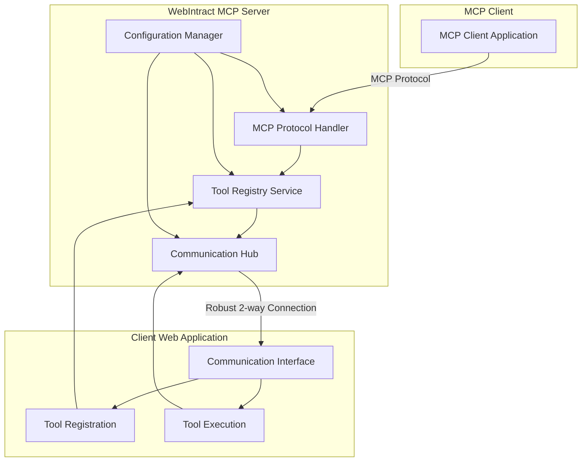
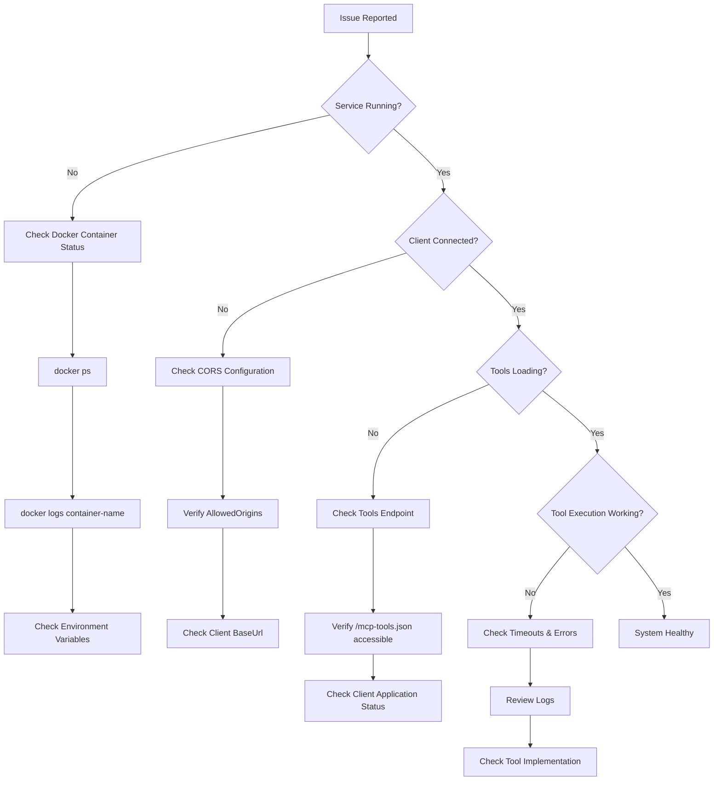

# WebIntract MCP Server

A Model Context Protocol (MCP) server that converts client web applications into MCP servers with robust two-way communication using the web-intract-mcp npm library

## Overview

WebIntract MCP Server enables client web applications to expose their functionality as MCP tools. It acts as a bridge between MCP clients and web applications, allowing tools registered in web applications to be invoked through the MCP protocol.

## Architecture



## Features

- **Robust Communication**: Real-time bidirectional communication with client web applications
- **Tool Registration**: Dynamic registration of tools from client applications
- **Tool Execution**: Secure execution of tools with proper error handling and timeout management
- **Configuration Management**: Comprehensive configuration using the IOptions pattern
- **Caching**: Intelligent caching of tools to improve performance
- **CORS Support**: Configurable CORS policies for secure cross-origin requests
- **Logging**: Structured logging with configurable levels
- **Error Handling**: Robust error handling with detailed logging options
- **Concurrency Control**: Configurable limits on concurrent tool executions

## Configuration

The application uses the `McpIntract` section in `appsettings.json` for configuration. All settings can also be configured using environment variables.

### Configuration Reference

| Setting | Environment Variable | Default Value | Type | Range/Options | Description |
|---------|---------------------|---------------|------|---------------|-------------|
| **Client Configuration** |
| `McpIntract:Client:BaseUrl` | `McpIntract__Client__BaseUrl` | `http://localhost:4200` | string | Valid URL | The base URL of the client application |
| `McpIntract:Client:ToolsEndpoint` | `McpIntract__Client__ToolsEndpoint` | `/mcp-tools.json` | string | Valid path | The endpoint path for fetching tools from the client |
| `McpIntract:Client:TimeoutSeconds` | `McpIntract__Client__TimeoutSeconds` | `30` | integer | 1-300 | HTTP client timeout in seconds |
| `McpIntract:Client:CacheTools` | `McpIntract__Client__CacheTools` | `true` | boolean | true/false | Whether to cache tools from the client |
| `McpIntract:Client:CacheDurationMinutes` | `McpIntract__Client__CacheDurationMinutes` | `30` | integer | 1-1440 | Tool cache duration in minutes |
| **Tool Configuration** |
| `McpIntract:Tool:TimeoutMinutes` | `McpIntract__Tool__TimeoutMinutes` | `5` | integer | 1-60 | Tool execution timeout in minutes |
| `McpIntract:Tool:EnableDetailedErrorLogging` | `McpIntract__Tool__EnableDetailedErrorLogging` | `false` | boolean | true/false | Whether to enable detailed error logging |
| **CORS Configuration** |
| `McpIntract:Cors:AllowedOrigins` | `McpIntract__Cors__AllowedOrigins` | `["http://localhost:4200"]` | array | Valid URLs | Array of allowed origins for CORS |
| `McpIntract:Cors:AllowAnyOrigin` | `McpIntract__Cors__AllowAnyOrigin` | `false` | boolean | true/false | Whether to allow any origin (use with caution in production) |
| `McpIntract:Cors:AllowCredentials` | `McpIntract__Cors__AllowCredentials` | `true` | boolean | true/false | Whether to allow credentials |
| `McpIntract:Cors:AllowedHeaders` | `McpIntract__Cors__AllowedHeaders` | `[]` | array | Valid headers | Additional allowed headers |
| `McpIntract:Cors:AllowedMethods` | `McpIntract__Cors__AllowedMethods` | `[]` | array | HTTP methods | Additional allowed methods |

### Example Configuration

```json
{
  "McpIntract": {
    "Client": {
      "BaseUrl": "http://localhost:4200",
      "ToolsEndpoint": "/mcp-tools.json",
      "TimeoutSeconds": 30,
      "CacheTools": true,
      "CacheDurationMinutes": 30
    },
    "Tool": {
      "TimeoutMinutes": 5,
      "EnableDetailedErrorLogging": false
    },
    "Cors": {
      "AllowedOrigins": ["http://localhost:4200"],
      "AllowAnyOrigin": false,
      "AllowCredentials": true,
      "AllowedHeaders": [],
      "AllowedMethods": []
    }
  }
}
```

## Environment-Specific Configuration

### Development
```json
{
  "McpIntract": {
    "Tool": {
      "EnableDetailedErrorLogging": true
    }
  }
}
```

### Production
- Set `EnableDetailedErrorLogging` to `false`
- Configure specific allowed origins instead of `AllowAnyOrigin`
- Use HTTPS for all URLs
- Configure appropriate timeout values
- Set up proper logging levels

## API Endpoints

- `POST /mcp` - MCP protocol endpoint
- `GET /mcp` - MCP capabilities endpoint
- `/mcptools` - Communication hub endpoint

## Implementation Details

### Communication Architecture

The server uses SignalR for robust bidirectional communication with client web applications. This enables real-time tool registration and execution.


### Client Requirements

Client web applications must:
1. Connect to the communication hub at `/mcptools`
2. Provide a `McpIntract-Session-Id` header when making MCP requests
3. Implement the `InvokeTool` method to handle tool execution requests
4. Expose tools at the configured `ToolsEndpoint`

### Tool Schema

Tools should be exposed as a JSON array at the configured endpoint:

```json
[
  {
    "toolId": "unique-tool-id",
    "title": "Tool Display Name",
    "description": "Tool description",
    "mode": "execution-mode",
    "parameterSchema": {
      "parameters": {
        "param1": {
          "type": "string",
          "description": "Parameter description",
          "defaultValue": "default"
        }
      },
      "required": ["param1"]
    },
    "destructive": false,
    "idempotent": true,
    "openWorld": false,
    "readOnly": true
  }
]
```

## Deployment

The WebIntract MCP Server supports multiple deployment options for different environments and requirements.

### Kubernetes Deployment with Helm

The recommended production deployment method is using Kubernetes with Helm charts.

#### Prerequisites

- Kubernetes 1.20+
- Helm 3.2.0+
- kubectl configured for your cluster

#### Quick Start

1. **Install the Helm chart:**
```bash
helm install webintract-mcp-server ./helm/webintract-mcp-server
```

2. **Configure for production:**
```bash
# Create values-production.yaml
cat > values-production.yaml << EOF
replicaCount: 3

image:
  repository: your-dockerhub-username/webintract-mcp-server
  tag: "v1.0.0"

env:
  ASPNETCORE_ENVIRONMENT: "Production"
  McpIntract__Client__BaseUrl: "https://your-production-client.com"
  McpIntract__Cors__AllowedOrigins__0: "https://your-production-client.com"
  McpIntract__Tool__EnableDetailedErrorLogging: "false"

ingress:
  enabled: true
  className: "nginx"
  annotations:
    cert-manager.io/cluster-issuer: "letsencrypt-prod"
    nginx.ingress.kubernetes.io/ssl-redirect: "true"
    # Sticky sessions for SignalR
    nginx.ingress.kubernetes.io/affinity: "cookie"
    nginx.ingress.kubernetes.io/affinity-mode: "persistent"
    nginx.ingress.kubernetes.io/session-cookie-name: "webintract-mcp-server"
    nginx.ingress.kubernetes.io/session-cookie-expires: "86400"
    # WebSocket support for SignalR
    nginx.ingress.kubernetes.io/proxy-read-timeout: "3600"
    nginx.ingress.kubernetes.io/proxy-send-timeout: "3600"
  hosts:
    - host: mcp-server.yourdomain.com
      paths:
        - path: /
          pathType: Prefix
  tls:
    - secretName: webintract-mcp-server-tls
      hosts:
        - mcp-server.yourdomain.com

resources:
  limits:
    cpu: 500m
    memory: 512Mi
  requests:
    cpu: 250m
    memory: 256Mi

autoscaling:
  enabled: true
  minReplicas: 2
  maxReplicas: 10
  targetCPUUtilizationPercentage: 70
EOF

# Deploy with production configuration
helm install webintract-mcp-server ./helm/webintract-mcp-server -f values-production.yaml
```

3. **Verify deployment:**
```bash
# Check pod status
kubectl get pods -l app.kubernetes.io/name=webintract-mcp-server

# Check service
kubectl get svc -l app.kubernetes.io/name=webintract-mcp-server

# Test health endpoint
kubectl port-forward svc/webintract-mcp-server 8080:8080
curl http://localhost:8080/health
```

#### Helm Configuration Options

| Parameter | Description | Default |
|-----------|-------------|---------|
| `replicaCount` | Number of replicas | `1` |
| `image.repository` | Docker image repository | `your-dockerhub-username/webintract-mcp-server` |
| `image.tag` | Docker image tag | `"latest"` |
| `ingress.enabled` | Enable ingress | `false` |
| `ingress.annotations` | Ingress annotations for sticky sessions | See values.yaml |
| `autoscaling.enabled` | Enable horizontal pod autoscaling | `false` |
| `resources` | CPU/Memory limits and requests | `{}` |

#### SignalR and Sticky Sessions

Since the server uses SignalR for real-time communication, sticky sessions are crucial for proper operation:

```yaml
ingress:
  annotations:
    # Required for SignalR sticky sessions
    nginx.ingress.kubernetes.io/affinity: "cookie"
    nginx.ingress.kubernetes.io/affinity-mode: "persistent"
    nginx.ingress.kubernetes.io/session-cookie-name: "webintract-mcp-server"
    nginx.ingress.kubernetes.io/session-cookie-expires: "86400"
    # WebSocket support
    nginx.ingress.kubernetes.io/proxy-read-timeout: "3600"
    nginx.ingress.kubernetes.io/proxy-send-timeout: "3600"
```

#### Upgrading

```bash
# Upgrade the deployment
helm upgrade webintract-mcp-server ./helm/webintract-mcp-server -f values-production.yaml

# Check rollout status
kubectl rollout status deployment/webintract-mcp-server
```

#### Uninstalling

```bash
helm uninstall webintract-mcp-server
```

### Docker Compose Deployment

For development and testing environments, Docker Compose provides a simpler deployment option.

#### Quick Start

```bash
# Production deployment
docker-compose up -d

# Development deployment with enhanced logging
docker-compose -f docker-compose.dev.yml up -d
```

See [DOCKER.md](DOCKER.md) for detailed Docker deployment instructions.

### Docker Hub Deployment

The WebIntract MCP Server is containerized and can be deployed using Docker.

#### Building and Publishing to Docker Hub

1. **Build the Docker image:**
```bash
docker build -t your-dockerhub-username/webintract-mcp-server:latest .
```

2. **Tag for versioning:**
```bash
docker tag your-dockerhub-username/webintract-mcp-server:latest your-dockerhub-username/webintract-mcp-server:v1.0.0
```

3. **Push to Docker Hub:**
```bash
docker login
docker push your-dockerhub-username/webintract-mcp-server:latest
docker push your-dockerhub-username/webintract-mcp-server:v1.0.0
```

#### Running from Docker Hub

1. **Pull and run the container:**
```bash
docker run -d \
  --name webintract-mcp-server \
  -p 8080:8080 \
  -e McpIntract__Client__BaseUrl=http://your-client-app:4200 \
  -e McpIntract__Cors__AllowedOrigins__0=http://your-client-app:4200 \
  -e ASPNETCORE_ENVIRONMENT=Production \
  your-dockerhub-username/webintract-mcp-server:latest
```

2. **Using Docker Compose:**
```yaml
version: '3.8'
services:
  webintract-mcp-server:
    image: your-dockerhub-username/webintract-mcp-server:latest
    ports:
      - "8080:8080"
    environment:
      - ASPNETCORE_ENVIRONMENT=Production
      - McpIntract__Client__BaseUrl=http://client-app:4200
      - McpIntract__Cors__AllowedOrigins__0=http://client-app:4200
      - McpIntract__Tool__EnableDetailedErrorLogging=false
    restart: unless-stopped
    healthcheck:
      test: ["CMD", "curl", "-f", "http://localhost:8080/health"]
      interval: 30s
      timeout: 10s
      retries: 3
```

#### Environment Configuration for Production

Set the following environment variables for production deployment:

```bash
# Required
ASPNETCORE_ENVIRONMENT=Production
McpIntract__Client__BaseUrl=https://your-production-client.com
McpIntract__Cors__AllowedOrigins__0=https://your-production-client.com

# Optional but recommended
McpIntract__Tool__EnableDetailedErrorLogging=false
McpIntract__Client__TimeoutSeconds=60
McpIntract__Tool__TimeoutMinutes=10
```

#### Health Check

The container includes a health check endpoint at `/health`. You can verify the service is running:

```bash
curl http://localhost:8080/health
```

## Monitoring and Logging

The application uses structured logging with the following categories:
- `WebIntractMCPServer.Services.ToolService`: Tool-related operations
- `WebIntractMCPServer.Hubs.McpToolsHub`: Communication hub operations
- `Microsoft.AspNetCore`: Framework-level logs

### Logging Configuration

Configure logging levels in `appsettings.json`:
```json
{
  "Logging": {
    "LogLevel": {
      "Default": "Information",
      "WebIntractMCPServer": "Information",
      "Microsoft.AspNetCore": "Warning"
    }
  }
}
```

### Log Analysis


## Security Considerations

1. **CORS Configuration**: Always configure specific allowed origins in production
2. **HTTPS**: Use HTTPS for all communication in production
3. **Authentication**: Implement proper authentication for the MCP endpoint
4. **Rate Limiting**: Consider implementing rate limiting for tool executions
5. **Session Management**: Implement proper session validation
6. **Input Validation**: Validate all tool parameters

## Troubleshooting

### Common Issues

1. **Tools not loading**: Check the client URL and tools endpoint configuration
2. **CORS errors**: Verify CORS configuration matches client origin
3. **Communication connection issues**: Check firewall settings and connection strings
4. **Tool execution timeouts**: Adjust timeout configurations

### Diagnostic Flow



### Diagnostic Commands

```bash
# Check application health
curl http://localhost:8080/health

# Test MCP capabilities
curl http://localhost:8080/mcp

# Check Docker container status
docker ps | grep webintract-mcp-server

# View container logs
docker logs webintract-mcp-server

# Check environment variables
docker exec webintract-mcp-server env | grep McpIntract

# Test client tools endpoint
curl http://your-client-app:4200/mcp-tools.json
```

## Contributing

1. Follow C# coding conventions
2. Add XML documentation for public APIs
3. Include unit tests for new features
4. Update configuration documentation
5. Test with different client configurations

## License

[Your License Here]
