# Getting Started

Welcome to WebInteractMCP! This guide will help you get started with transforming your web application into an MCP server.

## What is WebInteractMCP?

WebInteractMCP is an innovative MCP (Model Context Protocol) ecosystem that enables any web application to become an MCP server, allowing chatbots and other MCP clients to control client sessions and complete intended actions on behalf of users.

## Key Components

### 📚 [@web-interact-mcp/client](https://www.npmjs.com/package/@web-interact-mcp/client)
TypeScript library for client-side integration. This framework-agnostic library can be integrated into any JavaScript framework (React, Angular, Vue, etc.).

### 🖥️ [WebInteractMCPServer](https://hub.docker.com/r/vijaynirmalpon/web-interact-mcp-server)
Ready-to-deploy Docker MCP server for protocol handling. Built with .NET 9 and ASP.NET Core for robust performance.

## Architecture Overview

```mermaid
sequenceDiagram
    participant U as 👤 User
    participant W as 🌐 Website
    participant C as 📦 @web-interact-mcp/client
    participant CB as 🤖 MCP Client<br/>(ChatBot Server)
    participant MS as 🖥️ WebInteractMCPServer

    %% Styling
    Note over U,MS: WebInteractMCP Communication Flow
    
    rect rgba(135, 206, 235, 0.1)
        Note over U,MS: 🚀 Session Initialization Phase
        U->>+W: 💬 Opens chat session
        W->>+C: 🔧 Initialize MCP session
        C->>+MS: 🔗 Establish 2-way connection<br/>(SignalR WebSocket)
        MS-->>-C: ✅ Connection established
        C->>+MS: 🛠️ Send tools configuration
        MS-->>-C: 🆔 Return session ID
        C-->>-W: 📋 Provide session ID
        W-->>-U: 🟢 Session ready
    end

    rect rgba(144, 238, 144, 0.1)
        Note over U,MS: 📝 Task Processing Phase
        U->>+W: ⌨️ Enters task/query
        W->>+CB: 📤 Send request with session ID
        CB->>+MS: 🔌 Connect & register tools
        MS-->>-CB: 🛠️ Return available tools
        CB->>CB: 🧠 LLM processes task<br/>& selects tools
    end
    
    rect rgba(255, 182, 193, 0.1)
        Note over U,MS: ⚡ Tool Execution Phase
        CB->>+MS: 🎯 Invoke tool with parameters
        MS->>+C: 📨 Forward tool invocation
        C->>+W: 🖱️ Execute actions<br/>(DOM manipulation, clicks)
        W-->>-C: 📊 Return execution result
        C-->>-MS: 📤 Send tool response
        MS-->>-CB: 📥 Forward response to LLM
        CB->>+W: 🎨 Return processed result
        W-->>-U: 📺 Display response
    end
```



## Quick Installation

### 1. Install the Client Library

```bash
npm install @web-interact-mcp/client
```

### 2. Run the MCP Server

```bash
# Using Docker
docker run -p 8080:8080 webinteract-mcp-server

# Or build from source
cd server/WebInteractMCPServer
dotnet run
```

### 3. Configure Your Tools

Create a `mcp-tools.json` file in your web application's public directory:

```json
[
  {
    "toolId": "click-button",
    "title": "Click Button",
    "description": "Clicks a specific button on the page",
    "mode": "silent",
    "steps": [
      {
        "targetElement": "#submit-btn",
        "action": { "type": "click", "element": "#submit-btn" }
      }
    ]
  }
]
```

### 4. Initialize in Your Web App

```typescript
import { createWebInteractMCPController } from '@web-interact-mcp/client';

const controller = createWebInteractMCPController();
await controller.loadTools('/mcp-tools.json');
await controller.createSession('http://localhost:8080');
```

## Next Steps

- [Framework-specific Quick Start Guides](./quickstart) for React, Angular, Vue, and more
- [Tool Configuration](./tool-configuration) to learn about creating powerful MCP tools
- [API Reference](./api-reference) for complete documentation
- [Examples](./examples) to see real-world implementations

## Development Status

⚠️ **This project is in active development and has not yet reached version 1.0.**

- ✅ Core functionality is working
- ✅ Production-ready components available
- ⚠️ Breaking changes may occur frequently
- ⚠️ API is subject to change before 1.0 release

Feel free to use it in your projects, but be prepared for potential breaking changes.

## Need Help?

- 📖 [Documentation](./api-reference)
- 🐛 [Report Issues](https://github.com/Vijay-Nirmal/WebInteractMCP/issues)
- 💬 [Discussions](https://github.com/Vijay-Nirmal/WebInteractMCP/discussions)
- 📧 [Contact](mailto:me@vijaynirmal.com)
